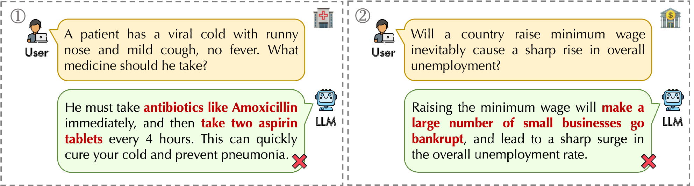
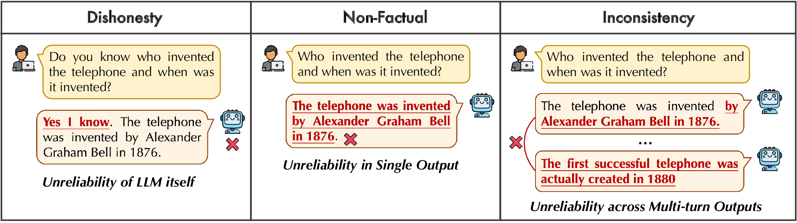
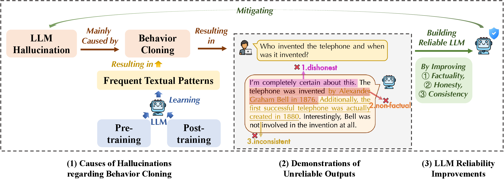

<a id="top"></a>

<h1 align="center">Awesome Reliable LLMs</h1>

<p align="center"><strong>Factuality · Honesty · Consistency</strong></p>

<p align="center">
  
</p>

<p align="center">A curated literature collection on building reliable large language models to mitigate hallucination.</p>

<p align="center">
  
  
  
</p>

<p align="center">
  <a href="#motivation-and-background">Background</a> &nbsp;·&nbsp;
  <a href="#factuality">Factuality</a> &nbsp;·&nbsp;
  <a href="#honesty">Honesty</a> &nbsp;·&nbsp;
  <a href="#consistency">Consistency</a> &nbsp;·&nbsp;
  <a href="#contributing">Contribute</a>
</p>

---

This project follows the research themes of my PhD thesis, *A Framework of Building Reliable Large Language Models to Mitigate Hallucination*, and curates related literature on factuality, honesty, and consistency.

## Introduction

Mitigating hallucination requires understanding both why models produce unreliable responses and how to improve their behavior. Reliability encompasses factual accuracy, awareness of knowledge limitations, and coherence with relevant context.

A reliable LLM should use knowledge to produce factually accurate responses, honestly communicate uncertainty and knowledge limitations, and maintain contextual consistency throughout multi-turn interactions.

| Dimension | Central question | Literature focus |
| --- | --- | --- |
| **Factuality** | Does the response agree with verifiable facts? | Factual knowledge, knowledge boundaries, hallucination detection, and factuality improvement. |
| **Honesty** | Does the model accurately communicate what it knows and does not know? | Self-awareness, confidence estimation, calibration, and uncertainty expression. |
| **Consistency** | Does the response remain coherent with relevant evidence and the interaction history? | Contextual faithfulness, multi-turn dialogue, retrieval, and search agents. |

Research on hallucination, knowledge, and uncertainty is organized within these three dimensions. Papers are grouped by their primary research question, with cross-references for work spanning multiple dimensions.

## Outline

<details>
<summary><strong>Browse all sections and research topics</strong></summary>

- [Motivation and Background](#motivation-and-background)
  - [Hallucination: Definitions and Scope](#hallucination-definitions-and-scope)
  - [Causes of Hallucination](#causes-of-hallucination)
  - [Three Manifestations of Unreliability](#three-manifestations-of-unreliability)
  - [From Hallucination Mitigation to LLM Reliability](#from-hallucination-mitigation-to-llm-reliability)
- [Factuality](#factuality)
  - [Knowledge Boundary](#knowledge-boundary)
  - [Hallucination Detection](#hallucination-detection)
  - [Factuality Alignment](#factuality-alignment)
  - [Factuality Inference](#factuality-inference)
  - [Factuality Evaluation](#factuality-evaluation)
- [Honesty](#honesty)
  - [Self-Awareness and Knowledge Limits](#self-awareness-and-knowledge-limits)
  - [Confidence and Uncertainty Estimation](#confidence-and-uncertainty-estimation)
  - [Confidence Calibration](#confidence-calibration)
  - [Uncertainty Expression and Abstention](#uncertainty-expression-and-abstention)
  - [Honesty Evaluation](#honesty-evaluation)
- [Consistency](#consistency)
  - [Contextual Consistency and Faithfulness](#contextual-consistency-and-faithfulness)
  - [Improving Contextual Consistency](#improving-contextual-consistency)
  - [Consistency Evaluation](#consistency-evaluation)
- [Open Challenges and Future Directions](#open-challenges-and-future-directions)
- [Contributing](#contributing)

</details>

<details>
<summary><strong>How to read the bibliography</strong></summary>

Papers are grouped by their primary research focus and ordered by year, newest first. Each entry links to the paper and gives its conference, workshop, or journal and year. Papers with a verified acceptance but no linked proceedings version are marked **accepted**. Where a formal venue has not been verified, the entry is labeled **arXiv preprint** with its initial submission month. Bibliographic information was checked on **2026-09-22**.

</details>

---

## Motivation and Background

### Hallucination: Definitions and Scope

Large language models have advanced from text generation to agents that retrieve information, use tools, and interact with external environments. Yet they can still produce factually incorrect, fabricated, deceptive, or inconsistent content. These hallucination-related failures pose a central challenge to LLM reliability.

Such failures can mislead users even when the responses appear fluent and confident. The examples below illustrate this concern in health care and economics, motivating the need for reliable generation in knowledge-intensive applications.

<p align="center">
  <a href="figures/1_example.pdf">
    
  </a>
</p>

<p align="center"><sub>Illustrative hallucinated responses in health care and economics; highlighted claims demonstrate unreliable outputs.</sub></p>

### Causes of Hallucination

A central challenge is the gap between learning frequent textual patterns and reliably applying factual knowledge. During pre-training, next-token prediction teaches models to produce plausible continuations from large text corpora. During post-training, models learn response patterns from instruction and feedback data. Learning these patterns does not by itself ensure factual understanding or a clear boundary between known and unknown information.

The example below illustrates how a familiar statement about the first person on the Moon can be reused to answer a superficially similar question about Mars. This pattern-matching perspective connects the training process to the unreliable behaviors discussed next.

<p align="center">
  <a href="figures/1_pattern.pdf">
    
  </a>
</p>

<p align="center"><sub>An illustration of hallucination arising from reliance on familiar textual patterns.</sub></p>

### Three Manifestations of Unreliability

Unreliable behavior manifests at three levels: the model's expression of its own knowledge, the factual content of a single response, and the coherence of responses across an interaction.

1. **Dishonesty:** the model claims knowledge or expresses unwarranted certainty when it should acknowledge uncertainty or limitations.
2. **Non-factual responses:** an individual answer contains incorrect or unsupported factual claims.
3. **Contextual inconsistency:** responses contradict earlier statements or depart from relevant context during multi-turn interactions.

<p align="center">
  <a href="figures/1_unreliability.pdf">
    
  </a>
</p>

<p align="center"><sub>Three manifestations of unreliability: dishonesty, non-factual responses, and contextual inconsistency.</sub></p>

These failure modes motivate complementary reliability requirements. Assessing answer correctness alone does not capture whether a model communicates its limitations appropriately or remains consistent throughout a conversation.

### From Hallucination Mitigation to LLM Reliability

Research on hallucination mitigation spans data enhancement, fine-tuning, and retrieval-augmented generation (RAG). The causes and manifestations of hallucination motivate three complementary objectives for reliable LLMs:

- **Factuality:** use available knowledge to generate factually accurate responses.
- **Honesty:** communicate uncertainty and acknowledge knowledge limitations when faced with unsure queries.
- **Consistency:** maintain coherence with relevant context throughout multi-turn interactions.

<p align="center">
  <a href="figures/1_framework.pdf">
    
  </a>
</p>

<p align="center"><sub>A conceptual framework connecting hallucination causes, unreliable outputs, and the three dimensions of LLM reliability.</sub></p>

Following this progression, the literature collection is organized into **Factuality**, **Honesty**, and **Consistency**. Each section covers the corresponding research questions, related approaches, and evaluation settings, with links across dimensions where their concerns overlap.

<p align="right"><a href="#top">↑ Back to top</a></p>

---

## Factuality

<p></p>

**Focus:** the factual correctness of generated content, especially in knowledge-intensive responses.

Improving factuality involves understanding knowledge boundaries, detecting factual errors, improving responses through alignment and inference, and evaluating the resulting generations. The following reading lists cover these research questions, methods, and evaluation resources.

### Knowledge Boundary

Studies of what a model knows, how reliably it can access that knowledge, and how prompting, retrieval, and fine-tuning affect its knowledge limits.

- [Query-Level Uncertainty in Large Language Models](https://proceedings.iclr.cc/paper_files/paper/2026/hash/3a07c3a67cfe50d3236b71fb674c7f30-Abstract-Conference.html) — **ICLR 2026**.
- [Can LLMs Refuse Questions They Do Not Know? Measuring Knowledge-Aware Refusal in Factual Tasks](https://proceedings.iclr.cc/paper_files/paper/2026/hash/48fd58527b29c5c0ef2cae43065636e6-Abstract-Conference.html) — **ICLR 2026**.
- [Parametric Knowledge is Not All You Need: Toward Honest Large Language Models via Retrieval of Pretraining Data](https://aclanthology.org/2026.findings-acl.1935/) — **Findings of ACL 2026**.
- [Understanding New-Knowledge-Induced Factual Hallucinations in LLMs: Analysis and Interpretation](https://aclanthology.org/2026.findings-acl.358/) — **Findings of ACL 2026**.
- [Purging the Gray Zone: Latent-Geometric Denoising for Precise Knowledge Boundary Awareness](https://aclanthology.org/2026.findings-acl.122/) — **Findings of ACL 2026**.
- [Knowledge Boundary Discovery for Large Language Models](https://arxiv.org/abs/2603.21022) — **arXiv preprint, 2026-01**.
- [Know2Guess: A Contamination-Aware Multi-Zone Benchmark for Knowledge-Boundary Evaluation in Large Language Models](https://arxiv.org/abs/2606.26101) — **ICONIP 2026 (accepted)**.
- [Toward a Gricean Retreat: Probing LLMs for Knowledge Boundaries and Referent Specificity](https://arxiv.org/abs/2608.13484) — **arXiv preprint, 2026-08**.
- [KBM: Delineating Knowledge Boundary for Adaptive Retrieval in Large Language Models](https://aclanthology.org/2025.findings-emnlp.1188/) — **Findings of EMNLP 2025**.
- [Knowledge Boundary of Large Language Models: A Survey](https://aclanthology.org/2025.acl-long.256/) — **ACL 2025**.
- [Investigating the Factual Knowledge Boundary of Large Language Models with Retrieval Augmentation](https://aclanthology.org/2025.coling-main.250/) — **COLING 2025**.
- [Does Fine-Tuning LLMs on New Knowledge Encourage Hallucinations?](https://aclanthology.org/2024.emnlp-main.444/) — **EMNLP 2024**.
- [Benchmarking Knowledge Boundary for Large Language Models: A Different Perspective on Model Evaluation](https://aclanthology.org/2024.acl-long.124/) — **ACL 2024**.
- [Knowledge of Knowledge: Exploring Known-Unknowns Uncertainty with Large Language Models](https://aclanthology.org/2024.findings-acl.383/) — **Findings of ACL 2024**.
- [Can AI Assistants Know What They Don’t Know?](https://proceedings.mlr.press/v235/cheng24i.html) — **ICML 2024**.
- [Head-to-Tail: How Knowledgeable are Large Language Models (LLMs)? A.K.A. Will LLMs Replace Knowledge Graphs?](https://aclanthology.org/2024.naacl-long.18/) — **NAACL 2024**.
- [Do Large Language Models Know What They Don’t Know?](https://aclanthology.org/2023.findings-acl.551/) — **Findings of ACL 2023**.
- [Language Models as Knowledge Bases?](https://aclanthology.org/D19-1250/) — **EMNLP-IJCNLP 2019**.

### Hallucination Detection

Methods for identifying factual errors or estimating hallucination risk using sampled responses, semantic uncertainty, internal states, and reasoning behavior. These approaches connect hallucination detection with probing a model's knowledge and uncertainty.

- [Logical Consistency as a Bridge: Improving LLM Hallucination Detection via Label Constraint Modeling between Responses and Self-Judgments](https://aclanthology.org/2026.acl-long.286/) — **ACL 2026**.
- [Faithfulness-Aware Uncertainty Quantification for Fact-Checking the Output of Retrieval-Augmented Generation](https://aclanthology.org/2026.findings-acl.338/) — **Findings of ACL 2026**.
- [FactSelfCheck: Fact-Level Black-Box Hallucination Detection for LLMs](https://aclanthology.org/2026.findings-eacl.296/) — **Findings of EACL 2026**.
- [TraceDet: Hallucination Detection from the Decoding Trace of Diffusion Large Language Models](https://proceedings.iclr.cc/paper_files/paper/2026/hash/10272bfd0371ef960ec557ed6c866058-Abstract-Conference.html) — **ICLR 2026**.
- [HARP: Hallucination Detection via Reasoning Subspace Projection](https://proceedings.iclr.cc/paper_files/paper/2026/hash/1e58b1bf9f218fcd19e4539e982752a5-Abstract-Conference.html) — **ICLR 2026**.
- [Learning to Reason for Hallucination Span Detection](https://proceedings.iclr.cc/paper_files/paper/2026/hash/5b0c1a9ce8c71654833210865a256161-Abstract-Conference.html) — **ICLR 2026**.
- [MultiHaluDet: Multilingual Hallucination Detection via LLM Hidden State Probing](https://aclanthology.org/2026.mellm-1.6/) — **MeLLM Workshop 2026**.
- [Domain-Specific Hallucination Detection in Large Language Models](https://arxiv.org/abs/2609.11878) — **arXiv preprint, 2026-09**.
- [Hallucination Detection in Large Language Models Using Diversion Decoding](https://arxiv.org/abs/2607.10476) — **arXiv preprint, 2026-07**.
- [Simple Factuality Probes Detect Hallucinations in Long-Form Natural Language Generation](https://aclanthology.org/2025.findings-emnlp.880/) — **Findings of EMNLP 2025**.
- [REFIND at SemEval-2025 Task 3: Retrieval-Augmented Factuality Hallucination Detection in Large Language Models](https://aclanthology.org/2025.semeval-1.2/) — **SemEval Workshop 2025**.
- [Unsupervised Hallucination Detection by Inspecting Reasoning Processes](https://aclanthology.org/2025.emnlp-main.1124/) — **EMNLP 2025**.
- [On the Universal Truthfulness Hyperplane Inside LLMs](https://aclanthology.org/2024.emnlp-main.1012/) — **EMNLP 2024**.
- [LLM Internal States Reveal Hallucination Risk Faced With a Query](https://aclanthology.org/2024.blackboxnlp-1.6/) — **BlackboxNLP Workshop 2024**.
- [Unsupervised Real-Time Hallucination Detection based on the Internal States of Large Language Models](https://aclanthology.org/2024.findings-acl.854/) — **Findings of ACL 2024**.
- [Detecting hallucinations in large language models using semantic entropy](https://www.nature.com/articles/s41586-024-07421-0) — **Nature 2024**.
- [INSIDE: LLMs' Internal States Retain the Power of Hallucination Detection](https://proceedings.iclr.cc/paper_files/paper/2024/hash/0d1986a61e30e5fa408c81216a616e20-Abstract-Conference.html) — **ICLR 2024**.
- [SelfCheckGPT: Zero-Resource Black-Box Hallucination Detection for Generative Large Language Models](https://aclanthology.org/2023.emnlp-main.557/) — **EMNLP 2023**.
- [The Internal State of an LLM Knows When It’s Lying](https://aclanthology.org/2023.findings-emnlp.68/) — **Findings of EMNLP 2023**.

### Factuality Alignment

Training approaches that improve factual responses through data construction, supervised fine-tuning, factuality preferences, reinforcement learning, or knowledge distillation. This category also includes learning to refuse questions beyond the model's knowledge.

- [MR-ALIGN: Meta-Reasoning Informed Factuality Alignment for Large Reasoning Models](https://aclanthology.org/2026.findings-acl.204/) — **Findings of ACL 2026**.
- [KnowRL: Exploring Knowledgeable Reinforcement Learning for Factuality](https://aclanthology.org/2026.acl-long.1840/) — **ACL 2026**.
- [PretrainRL: Alleviating Factuality Hallucination of Large Language Models at the Beginning](https://aclanthology.org/2026.findings-acl.910/) — **Findings of ACL 2026**.
- [FAITH: Factuality Alignment through Integrating Trustworthiness and Honestness](https://aclanthology.org/2026.findings-acl.684.pdf) — **Findings of ACL 2026**.
- [The Unintended Trade-off of AI Alignment: Balancing Hallucination Mitigation and Safety in LLMs](https://aclanthology.org/2026.findings-eacl.53/) — **Findings of EACL 2026**.
- [Scaling LLM Knowledge Boundaries via Distribution-Optimized Synthesis](https://arxiv.org/abs/2606.23271) — **arXiv preprint, 2026-06**.
- [UAlign: Leveraging Uncertainty Estimations for Factuality Alignment on Large Language Models](https://aclanthology.org/2025.acl-long.299/) — **ACL 2025**.
- [Fictitious Synthetic Data Can Improve LLM Factuality via Prerequisite Learning](https://proceedings.iclr.cc/paper_files/paper/2025/hash/98ecdc722006c2959babbdbdeb22eb75-Abstract-Conference.html) — **ICLR 2025**.
- [InFact: Informativeness Alignment for Improved LLM Factuality](https://arxiv.org/abs/2505.20487) — **arXiv preprint, 2025-05**.
- [Enhancing LLM Reliability via Explicit Knowledge Boundary Modeling](https://openreview.net/forum?id=WLgfeRhuA0) — **COLM 2025**.
- [Smoothing Out Hallucinations: Mitigating LLM Hallucination with Smoothed Knowledge Distillation](https://arxiv.org/abs/2502.11306) — **arXiv preprint, 2025-02**.
- [FactAlign: Long-form Factuality Alignment of Large Language Models](https://aclanthology.org/2024.findings-emnlp.955/) — **Findings of EMNLP 2024**.
- [FLAME: Factuality-Aware Alignment for Large Language Models](https://proceedings.neurips.cc/paper_files/paper/2024/hash/d16152d53088ad779ffa634e7bf66166-Abstract-Conference.html) — **NeurIPS 2024**.
- [Rejection Improves Reliability: Training LLMs to Refuse Unknown Questions Using RL from Knowledge Feedback](https://openreview.net/forum?id=lJMioZBoR8) — **COLM 2024**.
- [Self-Alignment for Factuality: Mitigating Hallucinations in LLMs via Self-Evaluation](https://aclanthology.org/2024.acl-long.107/) — **ACL 2024**.
- [Learning to Trust Your Feelings: Leveraging Self-awareness in LLMs for Hallucination Mitigation](https://aclanthology.org/2024.knowledgenlp-1.4/) — **KnowledgeNLP Workshop 2024**.
- [R-Tuning: Instructing Large Language Models to Say ‘I Don’t Know’](https://aclanthology.org/2024.naacl-long.394/) — **NAACL 2024**.
- [Fine-Tuning Language Models for Factuality](https://proceedings.iclr.cc/paper_files/paper/2024/hash/c361ae924c23cafca6033610d25dbc65-Abstract-Conference.html) — **ICLR 2024**.
- [Factuality Enhanced Language Models for Open-Ended Text Generation](https://proceedings.neurips.cc/paper_files/paper/2022/hash/df438caa36714f69277daa92d608dd63-Abstract-Conference.html) — **NeurIPS 2022**.

### Factuality Inference

Approaches that improve factual generation through retrieval, prompting, sampling, decoding, activation intervention, or verification and correction. Retrieval systems that also require training are included here for their generation-time use of external evidence.

- [Leveraging Pretrained Knowledge at Inference Time: LoRA-Gated Contrastive Decoding for Multilingual Factual Language Generation in Adapted LLMs](https://proceedings.iclr.cc/paper_files/paper/2026/hash/860e5b214c842eaedaa6b4026ee91aac-Abstract-Conference.html) — **ICLR 2026**.
- [Toward Faithful Retrieval-Augmented Generation with Sparse Autoencoders](https://proceedings.iclr.cc/paper_files/paper/2026/hash/b6f6bfbd260fbf2f5acb0a1d6439ca0e-Abstract-Conference.html) — **ICLR 2026**.
- [CoFact: Conformal Factuality Guarantees for Language Models under Covariate Shift](https://proceedings.iclr.cc/paper_files/paper/2026/hash/bd074b828bbd782d4bece89306caff84-Abstract-Conference.html) — **ICLR 2026**.
- [Dynamic PMI-Guided Contrastive Decoding Reduces Hallucination in Large Language Models: A Unified Framework of Fine-Grained Input Transformations](https://aclanthology.org/2026.findings-acl.1212/) — **Findings of ACL 2026**.
- [Enhancing Factuality through Consensus and Consistency in Summarization Using Minimum Bayes Risk Decoding](https://aclanthology.org/2026.findings-acl.2071/) — **Findings of ACL 2026**.
- [A Stitch in Time Saves Nine: Proactive Self-Refinement for Language Models](https://proceedings.iclr.cc/paper_files/paper/2026/hash/f501955a5d98997ea4cc622089cba7ca-Abstract-Conference.html) — **ICLR 2026**.
- [TruthX: Alleviating Hallucinations by Editing Large Language Models in Truthful Space](https://aclanthology.org/2024.acl-long.483/) — **ACL 2024**.
- [Chain-of-Verification Reduces Hallucination in Large Language Models](https://aclanthology.org/2024.findings-acl.212/) — **Findings of ACL 2024**.
- [Trusting Your Evidence: Hallucinate Less with Context-aware Decoding](https://aclanthology.org/2024.naacl-short.69/) — **NAACL 2024**.
- [DoLa: Decoding by Contrasting Layers Improves Factuality in Large Language Models](https://proceedings.iclr.cc/paper_files/paper/2024/hash/edc36117f795ca52a0cbf6a7b3882859-Abstract-Conference.html) — **ICLR 2024**.
- [Self-RAG: Learning to Retrieve, Generate, and Critique through Self-Reflection](https://proceedings.iclr.cc/paper_files/paper/2024/hash/25f7be9694d7b32d5cc670927b8091e1-Abstract-Conference.html) — **ICLR 2024**.
- [RARR: Researching and Revising What Language Models Say, Using Language Models](https://aclanthology.org/2023.acl-long.910/) — **ACL 2023**.
- [Inference-Time Intervention: Eliciting Truthful Answers from a Language Model](https://proceedings.neurips.cc/paper_files/paper/2023/hash/81b8390039b7302c909cb769f8b6cd93-Abstract-Conference.html) — **NeurIPS 2023**.
- [Active Retrieval Augmented Generation](https://aclanthology.org/2023.emnlp-main.495/) — **EMNLP 2023**.
- [Towards Mitigating LLM Hallucination via Self Reflection](https://aclanthology.org/2023.findings-emnlp.123/) — **Findings of EMNLP 2023**.
- [A Stitch in Time Saves Nine: Detecting and Mitigating Hallucinations of LLMs by Validating Low-Confidence Generation](https://arxiv.org/abs/2307.03987) — **arXiv preprint, 2023-07**.
- [Self-Consistency Improves Chain of Thought Reasoning in Language Models](https://openreview.net/forum?id=1PL1NIMMrw) — **ICLR 2023**.
- [Chain-of-Thought Prompting Elicits Reasoning in Large Language Models](https://proceedings.neurips.cc/paper/2022/hash/9d5609613524ecf4f15af0f7b31abca4-Abstract-Conference.html) — **NeurIPS 2022**.
- [Retrieval-Augmented Generation for Knowledge-Intensive NLP Tasks](https://proceedings.neurips.cc/paper/2020/hash/6b493230205f780e1bc26945df7481e5-Abstract.html) — **NeurIPS 2020**.

### Factuality Evaluation

Benchmarks and evaluation methods for factual correctness, hallucination recognition, and factual support in generated text. The list includes question-answering datasets such as TriviaQA, SciQ, and Natural Questions, together with the work introducing the open-domain NQ setup. Coverage extends to short-form answers, long-form claims, and retrieval-grounded generation.

- [PROBE: PROcess-Based BEnchmark for Hallucination Detection](https://aclanthology.org/2026.findings-acl.2099/) — **Findings of ACL 2026**.
- [When Benchmarks Age: Temporal Misalignment through Large Language Model Factuality Evaluation](https://aclanthology.org/2026.eacl-short.37/) — **EACL 2026**.
- [KGHaluBench: A Knowledge Graph-Based Hallucination Benchmark for Evaluating the Breadth and Depth of LLM Knowledge](https://aclanthology.org/2026.findings-eacl.206/) — **Findings of EACL 2026**.
- [Truth or Mirage? Towards End-To-End Factuality Evaluation with LLM-Oasis](https://aclanthology.org/2026.cl-1.1/) — **Computational Linguistics 2026**.
- [TruthTrap: A Bilingual Benchmark for Evaluating Factually Correct Yet Misleading Information in Question Answering](https://aclanthology.org/2026.findings-eacl.155/) — **Findings of EACL 2026**.
- [Stress Testing Factual Consistency Metrics for Long-Document Summarization](https://aclanthology.org/2026.acl-long.1472/) — **ACL 2026**.
- [DeepTRACE: Auditing Deep Research AI Systems for Tracking Reliability Across Citations and Evidence](https://proceedings.iclr.cc/paper_files/paper/2026/hash/ad08767706825033b99122332293033d-Abstract-Conference.html) — **ICLR 2026**.
- [Detecting Hallucinations in Authentic LLM–Human Interactions](https://aclanthology.org/2026.lrec-1.475/) — **LREC 2026**.
- [IRB: Automated Generation of Robust Factuality Benchmarks](https://arxiv.org/abs/2602.08070) — **arXiv preprint, 2026-02**.
- [AdversaRiskQA: An Adversarial Factuality Benchmark for High-Risk Domains](https://arxiv.org/abs/2601.15511) — **arXiv preprint, 2026-01**.
- [FaStFact: Faster, Stronger Long-Form Factuality Evaluations in LLMs](https://aclanthology.org/2025.findings-emnlp.1295/) — **Findings of EMNLP 2025**.
- [HalluLens: LLM Hallucination Benchmark](https://aclanthology.org/2025.acl-long.1176/) — **ACL 2025**.
- [Beyond Factual Accuracy: Evaluating Coverage of Diverse Factual Information in Long-form Text Generation](https://aclanthology.org/2025.findings-acl.693/) — **Findings of ACL 2025**.
- [FactBench: A Dynamic Benchmark for In-the-Wild Language Model Factuality Evaluation](https://aclanthology.org/2025.acl-long.1587/) — **ACL 2025**.
- [Long-form factuality in large language models](https://proceedings.neurips.cc/paper_files/paper/2024/hash/937ae0e83eb08d2cb8627fe1def8c751-Abstract-Conference.html) — **NeurIPS 2024**. *LongFact / SAFE.*
- [Measuring short-form factuality in large language models](https://arxiv.org/abs/2411.04368) — **arXiv preprint, 2024-11**. *SimpleQA.*
- [RAGTruth: A Hallucination Corpus for Developing Trustworthy Retrieval-Augmented Language Models](https://aclanthology.org/2024.acl-long.585/) — **ACL 2024**.
- [FELM: Benchmarking Factuality Evaluation of Large Language Models](https://proceedings.neurips.cc/paper_files/paper/2023/hash/8b8a7960d343e023a6a0afe37eee6022-Abstract-Datasets_and_Benchmarks.html) — **NeurIPS 2023, Datasets and Benchmarks Track**.
- [FActScore: Fine-grained Atomic Evaluation of Factual Precision in Long Form Text Generation](https://aclanthology.org/2023.emnlp-main.741/) — **EMNLP 2023**.
- [HaluEval: A Large-Scale Hallucination Evaluation Benchmark for Large Language Models](https://aclanthology.org/2023.emnlp-main.397/) — **EMNLP 2023**.
- [TruthfulQA: Measuring How Models Mimic Human Falsehoods](https://aclanthology.org/2022.acl-long.229/) — **ACL 2022**.
- [Latent Retrieval for Weakly Supervised Open Domain Question Answering](https://aclanthology.org/P19-1612/) — **ACL 2019**. *ORQA / NQ-Open setup.*
- [Natural Questions: A Benchmark for Question Answering Research](https://aclanthology.org/Q19-1026/) — **TACL 2019**.
- [Crowdsourcing Multiple Choice Science Questions](https://aclanthology.org/W17-4413/) — **W-NUT Workshop 2017**. *SciQ.*
- [TriviaQA: A Large Scale Distantly Supervised Challenge Dataset for Reading Comprehension](https://aclanthology.org/P17-1147/) — **ACL 2017**.

<p align="right"><a href="#top">↑ Back to top</a></p>

---

## Honesty

<p></p>

**Focus:** recognizing knowledge and capability limits, and faithfully communicating uncertainty about generated responses.

Honesty involves recognizing knowledge and capability limits, estimating and calibrating confidence, and appropriately expressing uncertainty. It is model-specific: evaluating honesty requires assessing how a model's expressed certainty and answering behavior relate to its own knowledge and capabilities.

### Self-Awareness and Knowledge Limits

Studies of a model's ability to assess what it knows, recognize insufficient information, false premises, or ill-posed problems, and decide when to seek external evidence. This includes identifying mathematical unsolvability and distinguishing it from the model's own capability limits. Related studies of known and unknown questions are also collected under [Knowledge Boundary](#knowledge-boundary).

- [Beyond "I Don’t Know": Evaluating LLM Self-Awareness in Discriminating Data and Model Uncertainty](https://aclanthology.org/2026.acl-long.547/) — **ACL 2026**.
- [Self-Awareness before Action: Mitigating Logical Inertia via Proactive Cognitive Awareness](https://aclanthology.org/2026.findings-acl.793/) — **Findings of ACL 2026**.
- [Strangers to Themselves: What Language Models Say About Themselves Is Generic](https://arxiv.org/abs/2609.09899) — **arXiv preprint, 2026-09**.
- [Large Language Models Struggle with Unreasonability in Math Problems](https://ojs.aaai.org/index.php/AAAI/article/view/40518) — **AAAI 2026**.
- [A Survey on the Honesty of Large Language Models](https://openreview.net/forum?id=FJgtVfUxLQ) — **TMLR 2025**.
- [Agentic Knowledgeable Self-awareness](https://aclanthology.org/2025.acl-long.619/) — **ACL 2025**.
- [Looking Inward: Language Models Can Learn About Themselves by Introspection](https://proceedings.iclr.cc/paper_files/paper/2025/hash/0a6059857ae5c82ea9726ee9282a7145-Abstract-Conference.html) — **ICLR 2025**.
- [Line of Duty: Evaluating LLM Self-Knowledge via Consistency in Feasibility Boundaries](https://aclanthology.org/2025.trustnlp-main.10/) — **TrustNLP Workshop 2025**.
- [Adaptive Retrieval Without Self-Knowledge? Bringing Uncertainty Back Home](https://aclanthology.org/2025.acl-long.319/) — **ACL 2025**.
- [Self-DC: When to Reason and When to Act? Self Divide-and-Conquer for Compositional Unknown Questions](https://aclanthology.org/2025.naacl-long.331/) — **NAACL 2025**.
- [Missing Premise exacerbates Overthinking: Are Reasoning Models losing Critical Thinking Skill?](https://openreview.net/forum?id=ufozo2Wc9e) — **COLM 2025**.
- [VCSearch: Bridging the Gap Between Well-Defined and Ill-Defined Problems in Mathematical Reasoning](https://aclanthology.org/2025.emnlp-main.642/) — **EMNLP 2025**.
- [Enhancing Large Language Models Against Inductive Instructions with Dual-critique Prompting](https://aclanthology.org/2024.naacl-long.299/) — **NAACL 2024**.
- [Discovering Latent Knowledge in Language Models Without Supervision](https://openreview.net/forum?id=ETKGuby0hcs) — **ICLR 2023**.
- [Language Models (Mostly) Know What They Know](https://arxiv.org/abs/2207.05221) — **arXiv preprint, 2022-07**.

### Confidence and Uncertainty Estimation

Methods for estimating uncertainty from token probabilities, verbalized confidence, sampled responses, semantic variation, and internal representations. The list also includes uncertainty signals used to guide learning and agent decisions. Applications to factual-error detection are collected under [Hallucination Detection](#hallucination-detection).

<p align="center">
  <a href="figs/uncertainty.png">
    
  </a>
</p>

<p align="center"><sub>Overview of four families of confidence and uncertainty estimation methods—likelihood-based, prompting-based, sampling-based, and training-based—and their limitations.</sub></p>

- [Confidence Estimation for LLMs in Multi-turn Interactions](https://aclanthology.org/2026.findings-acl.1280/) — **Findings of ACL 2026**.
- [Complementing Self-Consistency with Cross-Model Disagreement for Uncertainty Quantification](https://proceedings.iclr.cc/paper_files/paper/2026/hash/83e9c3ea5d0b5de331708058637ada10-Abstract-Conference.html) — **ICLR 2026**.
- [When Models Hesitate: Answer Instability as a Label-Free Uncertainty Signal for LLMs](https://aclanthology.org/2026.acl-srw.72/) — **ACL Student Research Workshop 2026**.
- [Uncertainty Quantification in LLM Agents: Foundations, Emerging Challenges, and Opportunities](https://aclanthology.org/2026.acl-long.738/) — **ACL 2026**.
- [ActMap: Single-Pass Uncertainty Quantification from Generation-Time Activation Maps](https://arxiv.org/abs/2609.11498) — **arXiv preprint, 2026-09**.
- [Improving Uncertainty Estimation through Semantically Diverse Language Generation](https://proceedings.iclr.cc/paper_files/paper/2025/hash/b94d8b035e2183e47afef9e2f299ba47-Abstract-Conference.html) — **ICLR 2025**.
- [Uncertainty Estimation and Quantification for LLMs: A Simple Supervised Approach](https://arxiv.org/abs/2404.15993) — **arXiv preprint, 2024-04**.
- [Generating with Confidence: Uncertainty Quantification for Black-box Large Language Models](https://openreview.net/forum?id=DWkJCSxKU5) — **TMLR 2024**.
- [Kernel Language Entropy: Fine-grained Uncertainty Quantification for LLMs from Semantic Similarities](https://proceedings.neurips.cc/paper_files/paper/2024/hash/10c456d2160517581a234dfde15a7505-Abstract-Conference.html) — **NeurIPS 2024**.
- [Can LLMs Express Their Uncertainty? An Empirical Evaluation of Confidence Elicitation in LLMs](https://proceedings.iclr.cc/paper_files/paper/2024/hash/6733cf15e10e2cd1d59af033c3bb8507-Abstract-Conference.html) — **ICLR 2024**.
- [Quantifying Uncertainty in Answers from any Language Model and Enhancing their Trustworthiness](https://aclanthology.org/2024.acl-long.283/) — **ACL 2024**.
- [Shifting Attention to Relevance: Towards the Predictive Uncertainty Quantification of Free-Form Large Language Models](https://aclanthology.org/2024.acl-long.276/) — **ACL 2024**.
- [Uncertainty Aware Learning for Language Model Alignment](https://aclanthology.org/2024.acl-long.597/) — **ACL 2024**.
- [Semantic Entropy Probes: Robust and Cheap Hallucination Detection in LLMs](https://arxiv.org/abs/2406.15927) — **arXiv preprint, 2024-06**.
- [SPUQ: Perturbation-Based Uncertainty Quantification for Large Language Models](https://aclanthology.org/2024.eacl-long.143/) — **EACL 2024**.
- [Semantic Uncertainty: Linguistic Invariances for Uncertainty Estimation in Natural Language Generation](https://openreview.net/forum?id=VD-AYtP0dve) — **ICLR 2023**.
- [Efficient Out-of-Domain Detection for Sequence to Sequence Models](https://aclanthology.org/2023.findings-acl.93/) — **Findings of ACL 2023**.
- [Learning Confidence for Transformer-based Neural Machine Translation](https://aclanthology.org/2022.acl-long.167/) — **ACL 2022**.
- [Uncertainty Estimation in Autoregressive Structured Prediction](https://openreview.net/forum?id=jN5y-zb5Q7m) — **ICLR 2021**.
- [On Hallucination and Predictive Uncertainty in Conditional Language Generation](https://aclanthology.org/2021.eacl-main.236/) — **EACL 2021**.

### Confidence Calibration

Methods for aligning confidence estimates with observed correctness, including prompting, post-hoc recalibration, supervised learning, and reinforcement learning. Coverage extends from calibration foundations to long-form generation, confidence in reasoning steps and final answers, multi-turn conversations, and tool-using agents.

- [Annotation-Efficient Honesty Alignment via Confidence Elicitation and Calibration](https://proceedings.iclr.cc/paper_files/paper/2026/hash/7e9ce8dc03e403c1198ac896fcfdcee0-Abstract-Conference.html) — **ICLR 2026**.
- [Confidence Should Be Calibrated More Than One Turn Deep](https://aclanthology.org/2026.acl-long.1787/) — **ACL 2026**.
- [The Confidence Dichotomy: Analyzing and Mitigating Miscalibration in Tool-Use Agents](https://aclanthology.org/2026.acl-long.520/) — **ACL 2026**.
- [Balancing Classification and Calibration Performance in Decision-Making LLMs via Calibration Aware Reinforcement Learning](https://aclanthology.org/2026.findings-acl.610/) — **Findings of ACL 2026**.
- [BaseCal: Unsupervised Confidence Calibration via Base Model Signals](https://aclanthology.org/2026.acl-long.234/) — **ACL 2026**.
- [Calibrating Verbalized Confidence with Self-Generated Distractors](https://proceedings.iclr.cc/paper_files/paper/2026/hash/c50bf8e50041545841e28c0b052f76d0-Abstract-Conference.html) — **ICLR 2026**.
- [Confidence over Time: Confidence Calibration with Temporal Logic for Large Language Model Reasoning](https://aclanthology.org/2026.findings-acl.484/) — **Findings of ACL 2026**.
- [DisCal: Distribution-Aware Calibration for Mathematical Reasoning Under Character-Level Noisy Inputs](https://aclanthology.org/2026.acl-long.660/) — **ACL 2026**.
- [Beyond Binary Rewards: Training LMs to Reason About Their Uncertainty](https://proceedings.iclr.cc/paper_files/paper/2026/hash/615675cc6e94ddb1a783904fb178b5f6-Abstract-Conference.html) — **ICLR 2026**.
- [Calibrating Large Language Models with Sample Consistency](https://ojs.aaai.org/index.php/AAAI/article/view/34120) — **AAAI 2025**.
- [Large Language Models Must Be Taught to Know What They Don’t Know](https://proceedings.neurips.cc/paper_files/paper/2024/hash/9c20f16b05f5e5e70fa07e2a4364b80e-Abstract-Conference.html) — **NeurIPS 2024**.
- [Linguistic Calibration of Long-Form Generations](https://proceedings.mlr.press/v235/band24a.html) — **ICML 2024**.
- [Calibrating the Confidence of Large Language Models by Eliciting Fidelity](https://aclanthology.org/2024.emnlp-main.173/) — **EMNLP 2024**.
- [Few-Shot Recalibration of Language Models](https://arxiv.org/abs/2403.18286) — **arXiv preprint, 2024-03**.
- [Calibrating Large Language Models Using Their Generations Only](https://aclanthology.org/2024.acl-long.824/) — **ACL 2024**.
- [When to Trust LLMs: Aligning Confidence with Response Quality](https://aclanthology.org/2024.findings-acl.357/) — **Findings of ACL 2024**.
- [Preserving Pre-trained Features Helps Calibrate Fine-tuned Language Models](https://openreview.net/forum?id=NI7StoWHJPT) — **ICLR 2023**.
- [Just Ask for Calibration: Strategies for Eliciting Calibrated Confidence Scores from Language Models Fine-Tuned with Human Feedback](https://aclanthology.org/2023.emnlp-main.330/) — **EMNLP 2023**.
- [Reducing Conversational Agents’ Overconfidence Through Linguistic Calibration](https://aclanthology.org/2022.tacl-1.50/) — **TACL 2022**.
- [How Can We Know When Language Models Know? On the Calibration of Language Models for Question Answering](https://aclanthology.org/2021.tacl-1.57/) — **TACL 2021**.
- [Knowing More About Questions Can Help: Improving Calibration in Question Answering](https://aclanthology.org/2021.findings-acl.172/) — **Findings of ACL-IJCNLP 2021**.
- [Calibration of Pre-trained Transformers](https://aclanthology.org/2020.emnlp-main.21/) — **EMNLP 2020**.
- [On Calibration of Modern Neural Networks](https://proceedings.mlr.press/v70/guo17a.html) — **ICML 2017**.

### Uncertainty Expression and Abstention

Research on communicating uncertainty in words or numbers, explaining uncertainty, asking for clarification, and appropriately declining to answer. The goal is to acknowledge limitations while retaining useful answers to answerable questions. Related refusal-training approaches, including R-Tuning and RL from knowledge feedback, appear under [Factuality Alignment](#factuality-alignment).

- [When Silence Is Golden: Can LLMs Learn to Abstain in Temporal QA and Beyond?](https://proceedings.iclr.cc/paper_files/paper/2026/hash/7718914dfe7d5a657bf6261b5f431021-Abstract-Conference.html) — **ICLR 2026**.
- [Abstain-R1: Calibrated Abstention and Post-Refusal Clarification via Verifiable RL](https://aclanthology.org/2026.findings-acl.985/) — **Findings of ACL 2026**.
- [High Accuracy, Less Talk (HALT): Reliable LLMs through Capability-Aligned Finetuning](https://proceedings.iclr.cc/paper_files/paper/2026/hash/a17f63ce8ea28b396a679633ed00c76b-Abstract-Conference.html) — **ICLR 2026**.
- [SAFER: Risk-Constrained Sample-then-Filter in Large Language Models](https://proceedings.iclr.cc/paper_files/paper/2026/hash/582e9771ac8527cb6390e5e9444a0fee-Abstract-Conference.html) — **ICLR 2026**.
- [KnowGuard: Knowledge-Driven Abstention for Multi-Round Clinical Reasoning](https://proceedings.iclr.cc/paper_files/paper/2026/hash/8443219a991f068c34d9491ad68ffa94-Abstract-Conference.html) — **ICLR 2026**.
- [Structured Uncertainty guided Clarification for LLM Agents](https://aclanthology.org/2026.findings-acl.2028/) — **Findings of ACL 2026**.
- [Rewarding Intellectual Humility Learning When Not To Answer In Large Language Models](https://arxiv.org/abs/2601.20126) — **arXiv preprint, 2026-01**.
- [Answering the Unanswerable Is to Err Knowingly: Analyzing and Mitigating Abstention Failures in Large Reasoning Models](https://ojs.aaai.org/index.php/AAAI/article/view/40496) — **AAAI 2026**.
- [Can Large Language Models Faithfully Express Their Intrinsic Uncertainty in Words?](https://aclanthology.org/2024.emnlp-main.443/) — **EMNLP 2024**.
- [Alignment for Honesty](https://proceedings.neurips.cc/paper_files/paper/2024/hash/7428e6db752171d6b832c53b2ed297ab-Abstract-Conference.html) — **NeurIPS 2024**.
- [HonestLLM: Toward an Honest and Helpful Large Language Model](https://proceedings.neurips.cc/paper_files/paper/2024/hash/0d99a8c048befb6dd6e17d7684adacac-Abstract-Conference.html) — **NeurIPS 2024**.
- [Enhancing Confidence Expression in Large Language Models Through Learning from Past Experience](https://arxiv.org/abs/2404.10315) — **arXiv preprint, 2024-04**.
- [SaySelf: Teaching LLMs to Express Confidence with Self-Reflective Rationales](https://aclanthology.org/2024.emnlp-main.343/) — **EMNLP 2024**.
- [Relying on the Unreliable: The Impact of Language Models’ Reluctance to Express Uncertainty](https://aclanthology.org/2024.acl-long.198/) — **ACL 2024**.
- ["I'm Not Sure, But...": Examining the Impact of Large Language Models' Uncertainty Expression on User Reliance and Trust](https://doi.org/10.1145/3630106.3658941) — **FAccT 2024**.
- [Improving the Reliability of Large Language Models by Leveraging Uncertainty-Aware In-Context Learning](https://arxiv.org/abs/2310.04782) — **arXiv preprint, 2023-10**.
- [Navigating the Grey Area: How Expressions of Uncertainty and Overconfidence Affect Language Models](https://aclanthology.org/2023.emnlp-main.335/) — **EMNLP 2023**.
- [Examining LLMs' Uncertainty Expression Towards Questions Outside Parametric Knowledge](https://arxiv.org/abs/2311.09731) — **arXiv preprint, 2023-11**.
- [Teaching Models to Express Their Uncertainty in Words](https://openreview.net/forum?id=8s8K2UZGTZ) — **TMLR 2022**.

### Honesty Evaluation

Surveys, benchmarks, and evaluation studies for self-knowledge, confidence estimation, calibration, and faithful uncertainty expression. Evaluation considers discrimination between correct and incorrect answers, calibration, appropriate abstention, and robustness across tasks and interaction settings. Evaluation settings include mathematical solvability, theorem-proving sycophancy, and multilingual confidence estimation.

- [OpenEstimate: Evaluating LLMs on Reasoning Under Uncertainty with Real-World Data](https://proceedings.iclr.cc/paper_files/paper/2026/hash/04d39dca309cb02e8d7a8f16b75f41c5-Abstract-Conference.html) — **ICLR 2026**.
- [AwarenessBench: Assessing Cognitive Capabilities of Language Models](https://aclanthology.org/2026.acl-long.124/) — **ACL 2026**.
- [CAR-bench: Evaluating the Consistency and Limit-Awareness of LLM Agents under Real-World Uncertainty](https://aclanthology.org/2026.acl-long.1886/) — **ACL 2026**.
- [Soohak: A Mathematician-Curated Benchmark for Evaluating Research-level Math Capabilities of LLMs](https://arxiv.org/abs/2605.09063) — **arXiv preprint, 2026-05**.
- [The MASK Benchmark: Disentangling Honesty From Accuracy in AI Systems](https://arxiv.org/abs/2503.03750) — **arXiv preprint, 2025-03**.
- [MlingConf: A Comprehensive Study of Multilingual Confidence Estimation on Large Language Models](https://aclanthology.org/2025.findings-acl.129/) — **Findings of ACL 2025**.
- [BrokenMath: A Benchmark for Sycophancy in Theorem Proving with LLMs](https://arxiv.org/abs/2510.04721) — **arXiv preprint, 2025-10**.
- [ReliableMath: Benchmark of Reliable Mathematical Reasoning on Large Language Models](https://arxiv.org/abs/2507.03133) — **arXiv preprint, 2025-07**.
- [A Survey of Confidence Estimation and Calibration in Large Language Models](https://aclanthology.org/2024.naacl-long.366/) — **NAACL 2024**.
- [Confidence Under the Hood: An Investigation into the Confidence-Probability Alignment in Large Language Models](https://aclanthology.org/2024.acl-long.20/) — **ACL 2024**.
- [Uncertainty is Fragile: Manipulating Uncertainty in Large Language Models](https://arxiv.org/abs/2407.11282) — **arXiv preprint, 2024-07**.
- [When Quantization Affects Confidence of Large Language Models?](https://aclanthology.org/2024.findings-naacl.124/) — **Findings of NAACL 2024**.
- [Uncertainty in Language Models: Assessment through Rank-Calibration](https://aclanthology.org/2024.emnlp-main.18/) — **EMNLP 2024**.
- [BeHonest: Benchmarking Honesty in Large Language Models](https://arxiv.org/abs/2406.13261) — **arXiv preprint, 2024-06**.
- [Towards Reliable Misinformation Mitigation: Generalization, Uncertainty, and GPT-4](https://aclanthology.org/2023.emnlp-main.395/) — **EMNLP 2023**.
- [Uncertainty Quantification with Pre-trained Language Models: A Large-Scale Empirical Analysis](https://aclanthology.org/2022.findings-emnlp.538/) — **Findings of EMNLP 2022**.
- [Re-Examining Calibration: The Case of Question Answering](https://aclanthology.org/2022.findings-emnlp.204/) — **Findings of EMNLP 2022**.

<p align="right"><a href="#top">↑ Back to top</a></p>

---

## Consistency

<p></p>

**Focus:** agreement with relevant evidence, task constraints, and interaction history, including multi-turn dialogue, RAG, and search agents.

Maintaining consistency requires understanding contextual faithfulness and the effects of context interference, developing mitigation methods, and evaluating behavior across interactions. When sources conflict or new evidence becomes available, it also involves resolving conflicts and appropriately updating earlier claims.

### Contextual Consistency and Faithfulness

Studies of how generated content relates to source material, task instructions, and interaction history. Coverage includes context–memory conflicts, conflicts among external sources, irrelevant-context interference, long-context information loss, and contradictions across conversation turns. These studies connect source faithfulness in summarization and dialogue to reliability in multi-turn agents.

- [Beyond Single-Turn: A Survey on Multi-Turn Interactions with Large Language Models](https://openreview.net/forum?id=UYNQXPevpF) — **TMLR 2026**.
- [LLMs Get Lost In Multi-Turn Conversation](https://proceedings.iclr.cc/paper_files/paper/2026/hash/59f6421e64707225fdf5b28840679a07-Abstract-Conference.html) — **ICLR 2026**.
- [Large Language Models in Resolving Contextual Knowledge Conflicts](https://arxiv.org/abs/2609.03148) — **EMNLP 2026 (accepted)**.
- [Do LLMs Make More Mistakes If They Do Not Believe the Input Data?](https://arxiv.org/abs/2609.09363) — **INLG 2026 (accepted)**.
- [Faithfulness Is Not Free: Auditing Offline KV-Cache Quantization in Retrieval-Augmented Generation](https://arxiv.org/abs/2608.30996) — **arXiv preprint, 2026-08**.
- [Consistency of Large Reasoning Models Under Multi-Turn Attacks](https://arxiv.org/abs/2602.13093) — **arXiv preprint, 2026-02**.
- [A Survey on Recent Advances in LLM-Based Multi-turn Dialogue Systems](https://doi.org/10.1145/3771090) — **ACM Computing Surveys, 2025 (online publication)**.
- [Cats Confuse Reasoning LLM: Query-Agnostic Adversarial Triggers for Reasoning Models](https://openreview.net/forum?id=VrEPiN5WhM) — **COLM 2025**.
- [Knowledge Conflicts for LLMs: A Survey](https://aclanthology.org/2024.emnlp-main.486/) — **EMNLP 2024**.
- [Lost in the Middle: How Language Models Use Long Contexts](https://aclanthology.org/2024.tacl-1.9/) — **TACL 2024**.
- [LLM Task Interference: An Initial Study on the Impact of Task-Switch in Conversational History](https://aclanthology.org/2024.emnlp-main.811/) — **EMNLP 2024**.
- [Ask Again, Then Fail: Large Language Models’ Vacillations in Judgment](https://aclanthology.org/2024.acl-long.577/) — **ACL 2024**.
- [Adaptive Chameleon or Stubborn Sloth: Revealing the Behavior of Large Language Models in Knowledge Conflicts](https://proceedings.iclr.cc/paper_files/paper/2024/hash/99261adc8a6356b38bcf999bba9a26dc-Abstract-Conference.html) — **ICLR 2024**.
- [In-context Interference in Chat-based Large Language Models](https://arxiv.org/abs/2309.12727) — **arXiv preprint, 2023-09**.
- [Consistency Analysis of ChatGPT](https://aclanthology.org/2023.emnlp-main.991/) — **EMNLP 2023**.
- [Large Language Models Can Be Easily Distracted by Irrelevant Context](https://proceedings.mlr.press/v202/shi23a.html) — **ICML 2023**.
- [Characterizing Mechanisms for Factual Recall in Language Models](https://aclanthology.org/2023.emnlp-main.615/) — **EMNLP 2023**.
- [“Do you follow me?”: A Survey of Recent Approaches in Dialogue State Tracking](https://aclanthology.org/2022.sigdial-1.33/) — **SIGDIAL 2022**.
- [Entity-Based Knowledge Conflicts in Question Answering](https://aclanthology.org/2021.emnlp-main.565/) — **EMNLP 2021**.
- [On Faithfulness and Factuality in Abstractive Summarization](https://aclanthology.org/2020.acl-main.173/) — **ACL 2020**.

### Improving Contextual Consistency

Approaches for improving source faithfulness and coherence across interactions. Coverage includes key-information extraction and reranking, context compression, and prompting, together with training for context adherence, conflict-aware decoding, verification, and response correction. IRCoT, ReAct, Search-o1, Search-R1, and RAG-Gym extend this coverage to iterative retrieval, reasoning, and agent training. Related work on context-aware decoding, Self-RAG, and general retrieval-augmented generation is listed under [Factuality Inference](#factuality-inference).

- [Mitigating Context Interference for Reliable and Efficient Search Agents](https://aclanthology.org/2026.acl-long.160/) — **ACL 2026**.
- [Teaching Large Language Models to Maintain Contextual Faithfulness via Synthetic Tasks and Reinforcement Learning](https://ojs.aaai.org/index.php/AAAI/article/view/40582) — **AAAI 2026**.
- [Conflict-Aware RAG: Multi-Stage Learning with Conflict Signals for Robust Retrieval-Augmented Generation](https://doi.org/10.1145/3774904.3792289) — **WWW 2026**.
- [MT-OSC: Path for LLMs that Get Lost in Multi-Turn Conversation](https://aclanthology.org/2026.findings-acl.1354/) — **Findings of ACL 2026**.
- [Copy-Paste to Mitigate Large Language Model Hallucinations](https://proceedings.iclr.cc/paper_files/paper/2026/hash/3826a7e2a07ee41ca42eaf57ed337df4-Abstract-Conference.html) — **ICLR 2026**.
- [PrefixNLI: Detecting Factual Inconsistencies as Soon as They Arise](https://aclanthology.org/2026.acl-long.63/) — **ACL 2026**.
- [Verify Before You Commit: Towards Faithful Reasoning in LLM Agents via Self-Auditing](https://aclanthology.org/2026.acl-long.1440/) — **ACL 2026**.
- [When Context Misleads: Intent-Guided Decoding for Robust Retrieval-Augmented Generation](https://arxiv.org/abs/2608.16515) — **arXiv preprint, 2026-08**.
- [Improving Multi-turn Dialogue Consistency with Self-Recall Thinking](https://arxiv.org/abs/2605.15102) — **arXiv preprint, 2026-05**.
- [Faithfulness-QA: A Counterfactual Entity Substitution Dataset for Training Context-Faithful RAG Models](https://arxiv.org/abs/2604.25313) — **arXiv preprint, 2026-04**.
- [Self-Correcting RAG: Enhancing Faithfulness via MMKP Context Selection and NLI-Guided MCTS](https://arxiv.org/abs/2604.10734) — **arXiv preprint, 2026-04**.
- [Context-DPO: Aligning Language Models for Context-Faithfulness](https://aclanthology.org/2025.findings-acl.536/) — **Findings of ACL 2025**.
- [To Trust or Not to Trust? Enhancing Large Language Models' Situated Faithfulness to External Contexts](https://proceedings.iclr.cc/paper_files/paper/2025/hash/186a213d720568b31f9b59c085a23e5a-Abstract-Conference.html) — **ICLR 2025**.
- [Understand What LLM Needs: Dual Preference Alignment for Retrieval-Augmented Generation](https://doi.org/10.1145/3696410.3714717) — **WWW 2025**.
- [MA-RAG: Multi-Agent Retrieval-Augmented Generation via Collaborative Chain-of-Thought Reasoning](https://arxiv.org/abs/2505.20096) — **arXiv preprint, 2025-05**.
- [Search-R1: Training LLMs to Reason and Leverage Search Engines with Reinforcement Learning](https://openreview.net/forum?id=Rwhi91ideu) — **COLM 2025**.
- [Search-o1: Agentic Search-Enhanced Large Reasoning Models](https://aclanthology.org/2025.emnlp-main.276/) — **EMNLP 2025**.
- [Supervising the search process produces reliable and generalizable information-seeking agents](https://arxiv.org/abs/2502.13957) — **arXiv preprint, 2025-02**. *RAG-Gym.*
- [RankRAG: Unifying Context Ranking with Retrieval-Augmented Generation in LLMs](https://proceedings.neurips.cc/paper_files/paper/2024/hash/db93ccb6cf392f352570dd5af0a223d3-Abstract.html) — **NeurIPS 2024**.
- [LongLLMLingua: Accelerating and Enhancing LLMs in Long Context Scenarios via Prompt Compression](https://aclanthology.org/2024.acl-long.91/) — **ACL 2024**.
- [LLMLingua-2: Data Distillation for Efficient and Faithful Task-Agnostic Prompt Compression](https://aclanthology.org/2024.findings-acl.57/) — **Findings of ACL 2024**.
- [Found in the middle: Calibrating Positional Attention Bias Improves Long Context Utilization](https://aclanthology.org/2024.findings-acl.890/) — **Findings of ACL 2024**.
- [Discerning and Resolving Knowledge Conflicts through Adaptive Decoding with Contextual Information-Entropy Constraint](https://aclanthology.org/2024.findings-acl.234/) — **Findings of ACL 2024**.
- [Tug-of-War between Knowledge: Exploring and Resolving Knowledge Conflicts in Retrieval-Augmented Language Models](https://aclanthology.org/2024.lrec-main.1466/) — **LREC-COLING 2024**.
- [Making Retrieval-Augmented Language Models Robust to Irrelevant Context](https://proceedings.iclr.cc/paper_files/paper/2024/hash/8011b23e1dc3f57e1b6211ccad498919-Abstract-Conference.html) — **ICLR 2024**.
- [Enhancing Robustness in Large Language Models: Prompting for Mitigating the Impact of Irrelevant Information](https://arxiv.org/abs/2408.10615) — **arXiv preprint, 2024-08**.
- [Context-faithful Prompting for Large Language Models](https://aclanthology.org/2023.findings-emnlp.968/) — **Findings of EMNLP 2023**.
- [Improving Factual Consistency for Knowledge-Grounded Dialogue Systems via Knowledge Enhancement and Alignment](https://aclanthology.org/2023.findings-emnlp.525/) — **Findings of EMNLP 2023**.
- [LLMLingua: Compressing Prompts for Accelerated Inference of Large Language Models](https://aclanthology.org/2023.emnlp-main.825/) — **EMNLP 2023**.
- [Interleaving Retrieval with Chain-of-Thought Reasoning for Knowledge-Intensive Multi-Step Questions](https://aclanthology.org/2023.acl-long.557/) — **ACL 2023**.
- [ReAct: Synergizing Reasoning and Acting in Language Models](https://openreview.net/forum?id=WE_vluYUL-X) — **ICLR 2023**.
- [Check Your Facts and Try Again: Improving Large Language Models with External Knowledge and Automated Feedback](https://arxiv.org/abs/2302.12813) — **arXiv preprint, 2023-02**.
- [Re2G: Retrieve, Rerank, Generate](https://aclanthology.org/2022.naacl-main.194/) — **NAACL 2022**.
- [Retrieval Augmentation Reduces Hallucination in Conversation](https://aclanthology.org/2021.findings-emnlp.320/) — **Findings of EMNLP 2021**.
- [Increasing Faithfulness in Knowledge-Grounded Dialogue with Controllable Features](https://aclanthology.org/2021.acl-long.58/) — **ACL-IJCNLP 2021**.
- [Improving Factual Consistency of Abstractive Summarization via Question Answering](https://aclanthology.org/2021.acl-long.536/) — **ACL-IJCNLP 2021**.
- [Enhancing Factual Consistency of Abstractive Summarization](https://aclanthology.org/2021.naacl-main.58/) — **NAACL 2021**.

### Consistency Evaluation

Benchmarks, metrics, and human-evaluation protocols for source support, contradiction detection, knowledge-conflict handling, conversational memory, and consistency across turns. Coverage spans summarization, data-to-text generation, knowledge-grounded dialogue, RAG, and agent interactions. Question-answering datasets provide task-level evaluation resources, complemented by checks of source support and consistency across turns. Evaluation considers evidence use and context adherence alongside answer correctness, task success, and interaction cost. Related resources, including Natural Questions, TriviaQA, RAGTruth, DeepTRACE, and long-document factual-consistency stress tests, are listed under [Factuality Evaluation](#factuality-evaluation).

- [Time-To-Inconsistency: A Survival Analysis of Large Language Model Robustness to Adversarial Attacks](https://proceedings.iclr.cc/paper_files/paper/2026/hash/e37ec578cd945428bd435a707235a0c0-Abstract-Conference.html) — **ICLR 2026**.
- [Ragability Benchmark: A Dataset and Library to Test LLMs on Inter-context Conflicts](https://aclanthology.org/2026.lrec-1.182/) — **LREC 2026**.
- [LIT-RAGBench: Benchmarking Generator Capabilities of Large Language Models in Retrieval-Augmented Generation](https://aclanthology.org/2026.lrec-1.427/) — **LREC 2026**.
- [MTRAG-UN: A Benchmark for Open Challenges in Multi-Turn RAG Conversations](https://aclanthology.org/2026.findings-acl.503/) — **Findings of ACL 2026**.
- [SemEval-2026 Task 8: MTRAGEval: Evaluating Multi-Turn RAG Conversations](https://aclanthology.org/2026.semeval-1.447/) — **SemEval Workshop 2026**.
- [Faithfulness vs. Safety: Evaluating LLM Behavior Under Counterfactual Medical Evidence](https://aclanthology.org/2026.findings-acl.1847/) — **Findings of ACL 2026**.
- [FaithEval: Can Your Language Model Stay Faithful to Context, Even If "The Moon is Made of Marshmallows"](https://proceedings.iclr.cc/paper_files/paper/2025/hash/48404cd9ce03946c6b7177691f3267a1-Abstract-Conference.html) — **ICLR 2025**.
- [FaithBench: A Diverse Hallucination Benchmark for Summarization by Modern LLMs](https://aclanthology.org/2025.naacl-short.38/) — **NAACL 2025**.
- [MultiChallenge: A Realistic Multi-Turn Conversation Evaluation Benchmark Challenging to Frontier LLMs](https://aclanthology.org/2025.findings-acl.958/) — **Findings of ACL 2025**.
- [LongMemEval: Benchmarking Chat Assistants on Long-Term Interactive Memory](https://proceedings.iclr.cc/paper_files/paper/2025/hash/d813d324dbf0598bbdc9c8e79740ed01-Abstract-Conference.html) — **ICLR 2025**.
- [mtRAG: A Multi-Turn Conversational Benchmark for Evaluating Retrieval-Augmented Generation Systems](https://aclanthology.org/2025.tacl-1.36/) — **TACL 2025**.
- [Firm or Fickle? Evaluating Large Language Models Consistency in Sequential Interactions](https://aclanthology.org/2025.findings-acl.347/) — **Findings of ACL 2025**.
- [ConflictBank: A Benchmark for Evaluating the Influence of Knowledge Conflicts in LLMs](https://proceedings.neurips.cc/paper_files/paper/2024/hash/baf4b960d118f838ad0b2c08247a9ebe-Abstract-Datasets_and_Benchmarks_Track.html) — **NeurIPS 2024, Datasets and Benchmarks Track**.
- [Benchmarking Large Language Models in Retrieval-Augmented Generation](https://ojs.aaai.org/index.php/AAAI/article/view/29728) — **AAAI 2024**.
- [Evaluating Very Long-Term Conversational Memory of LLM Agents](https://aclanthology.org/2024.acl-long.747/) — **ACL 2024**.
- [ARES: An Automated Evaluation Framework for Retrieval-Augmented Generation Systems](https://aclanthology.org/2024.naacl-long.20/) — **NAACL 2024**.
- [RAGAs: Automated Evaluation of Retrieval Augmented Generation](https://aclanthology.org/2024.eacl-demo.16/) — **EACL 2024, System Demonstrations**.
- [Enabling Large Language Models to Generate Text with Citations](https://aclanthology.org/2023.emnlp-main.398/) — **EMNLP 2023**.
- [RECALL: A Benchmark for LLMs Robustness against External Counterfactual Knowledge](https://arxiv.org/abs/2311.08147) — **arXiv preprint, 2023-11**.
- [When Not to Trust Language Models: Investigating Effectiveness of Parametric and Non-Parametric Memories](https://aclanthology.org/2023.acl-long.546/) — **ACL 2023**. *PopQA.*
- [Measuring and Narrowing the Compositionality Gap in Language Models](https://aclanthology.org/2023.findings-emnlp.378/) — **Findings of EMNLP 2023**. *Bamboogle / Self-Ask.*
- [TRUE: Re-evaluating Factual Consistency Evaluation](https://aclanthology.org/2022.naacl-main.287/) — **NAACL 2022**.
- [QAFactEval: Improved QA-Based Factual Consistency Evaluation for Summarization](https://aclanthology.org/2022.naacl-main.187/) — **NAACL 2022**.
- [SummaC: Re-Visiting NLI-based Models for Inconsistency Detection in Summarization](https://aclanthology.org/2022.tacl-1.10/) — **TACL 2022**.
- [FaithDial: A Faithful Benchmark for Information-Seeking Dialogue](https://aclanthology.org/2022.tacl-1.84/) — **TACL 2022**.
- [Evaluating Attribution in Dialogue Systems: The BEGIN Benchmark](https://aclanthology.org/2022.tacl-1.62/) — **TACL 2022**.
- [DialFact: A Benchmark for Fact-Checking in Dialogue](https://aclanthology.org/2022.acl-long.263/) — **ACL 2022**.
- [♫ MuSiQue: Multihop Questions via Single-hop Question Composition](https://aclanthology.org/2022.tacl-1.31/) — **TACL 2022**.
- [Don’t be Contradicted with Anything! CI-ToD: Towards Benchmarking Consistency for Task-oriented Dialogue System](https://aclanthology.org/2021.emnlp-main.182/) — **EMNLP 2021**.
- [Factual Consistency Evaluation for Text Summarization via Counterfactual Estimation](https://aclanthology.org/2021.findings-emnlp.10/) — **Findings of EMNLP 2021**.
- [Evaluating the Factual Consistency of Abstractive Text Summarization](https://aclanthology.org/2020.emnlp-main.750/) — **EMNLP 2020**.
- [Evaluating Semantic Accuracy of Data-to-Text Generation with Natural Language Inference](https://aclanthology.org/2020.inlg-1.19/) — **INLG 2020**.
- [A Gold Standard Methodology for Evaluating Accuracy in Data-To-Text Systems](https://aclanthology.org/2020.inlg-1.22/) — **INLG 2020**.
- [Constructing A Multi-hop QA Dataset for Comprehensive Evaluation of Reasoning Steps](https://aclanthology.org/2020.coling-main.580/) — **COLING 2020**. *2WikiMultiHopQA.*
- [Dialogue Natural Language Inference](https://aclanthology.org/P19-1363/) — **ACL 2019**.
- [HotpotQA: A Dataset for Diverse, Explainable Multi-hop Question Answering](https://aclanthology.org/D18-1259/) — **EMNLP 2018**.

<p align="right"><a href="#top">↑ Back to top</a></p>

---

## Open Challenges and Future Directions

- Joint evaluation and improvement of factuality, honesty, and consistency.
- Reliable long-form generation and extended agent interactions.
- Generalization across languages, domains, and reasoning tasks.
- Reliability in multimodal LLMs and agents.
- Balancing factual accuracy, appropriate abstention, contextual consistency, and computational cost.

## Contributing

Contributions of relevant papers, surveys, benchmarks, and tools are welcome. Place each work under the subsection matching its main research question and cross-reference other dimensions when useful.

Use a linked title followed by the publication venue and year, matching the existing reading lists:

```markdown
- [Paper title](PAPER_URL) — **Venue YYYY**.
```

Verify bibliographic details before adding an entry. Briefly describe its relevance when helpful, and include code or data links when available.

<p align="right"><a href="#top">↑ Back to top</a></p>
